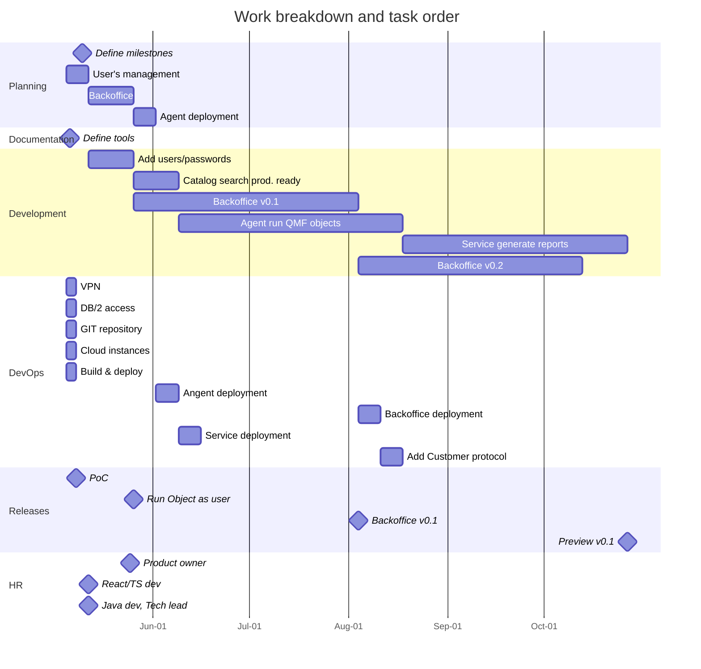
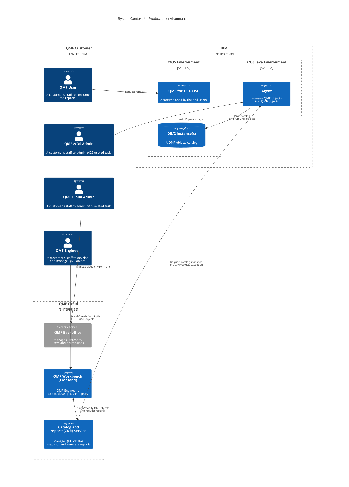
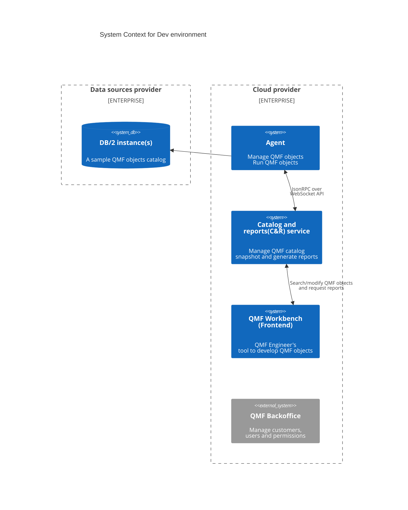
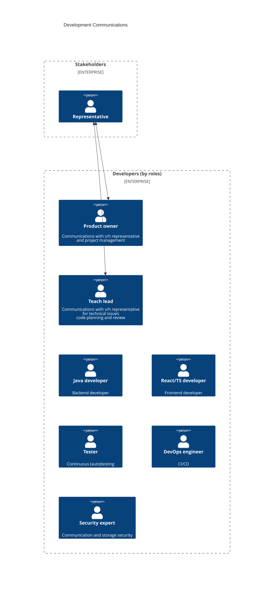

# QMF Cloud - Implementation Plan

> "QMF Cloud" is a temporary reference name of the product.

## Roadmap

> The roadmap is a top-level work breakdown ballpark estimate of the product development.

## Components TODOs

### Agent
 - [ ] Connects to DB/2 with configured credentials, needs to use the credentials of the current user
 - [ ] Needs to be able to run QMF objects and provide result data
 - [ ] Probably more the one QMF repository per agent
 - [ ] Communication encryption
 - [ ] Confirm agent & service identity

### Service
 - [ ] Sync DB/2 catalog with the service using provided DB/2 credentials (TBD: service is per user? snapshot per user?)
 - [ ] Request QMF objects execution results and generate report previews

### Workbench (Frontend)
 - [ ] Send current user credentials to the service with each request/establish session
 - [ ] format the report locally?

### Backoffice
 - [ ] Manage "organizations" (QMF customers)
 - [ ] Manage users and their roles per organization by QMF Cloud admin (see below)
 - [ ] Instructions to install the agent
 - [ ] Manage regiterd agnents

## Questions

> They should be either removed or converted to TODOs

1. Will we have our own authentication system or will we use DB/2 authentication?
1. How associate db2 users with the services(snapshots) they can use? Dummy db/2 request?
1. Will the specific service (cluster) serve exactly one QMF Customer? (then security can be set by its config)
1. Should the service use user's credentials to sync catalog with the snapshot?
1. What is more than one user syncs the catalog at the same time? Should each user have its own snapshot?
1. Should be objects execution results be truncated to some limit to shorten the report preview?
1. Is it ok for service to be stateful? (e.g. remember the last viewed page of the report)

## Contexts
> this section needs to be confirmed

The final product is deployed across **three zones of responsibility**, each with distinct roles
and assets involved in the delivery and use of QMF Cloud.

## IBM

IBM is responsible for providing and maintaining the core infrastructure on the customer’s premises:

- **DB2 instance(s)** for data storage and access.
- **z/OS environment** to support:
    - QMF (Query Management Facility) running in TSO/CICS.
    - Installation and execution of the QMF Cloud Agent, a Java-based component running within the customer's environment.

## QMF Customer

The QMF Customer is the end-user organization and is represented by several internal roles:

### Roles:

- **QMF z/OS Admin**
    - Customer staff responsible for administering the z/OS environment.
    - Installs and upgrades the QMF Cloud Agent as needed.

- **QMF Cloud Admin**
    - Manages access and roles within the QMF Cloud environment.
    - Oversees the team of QMF Engineers, handling their permissions and configurations.

- **QMF Engineer**
    - Primary end-user of the QMF Workbench (frontend).
    - Develops and manages QMF objects using the QMF Workbench (frontend)
    - Allowed to run and preview reports in the development context, but **not supposed to execute real (production) reports**.

- **QMF User**
    - A general customer staff member who consumes production reports.
    - **Not to be contacted** for any operational tasks.
    - **Does not access the QMF Cloud** at any point.

## QMF Cloud

This is the hosted component of the product, provided by the QMF Cloud team. All parts of the solution not running on the customer's infrastructure fall under this responsibility.

### QMF Cloud Service(s)
 - Enhance catalog management with an indexed snapshot.
 - Generate report previews used during QMF object development.

### QMF Workbench (frontend)
A development tool used by QMF Engineers to:
 - Create and manage QMF objects.
 - Run and preview reports within the cloud context (non-production).

### QMF Cloud Agent
 - Deployed on the customer's z/OS system
 - Acts as the bridge between QMF Cloud and the on-premise DB2/QMF environment.

During development, the product runs in a simplified environment, which is
primarily characterized by the absence of z/OS, as it is not required at
this stage

The development team generally consolidates communications internally and interacts with
stakeholders through the product owner and technical lead representatives. The product
owner is responsible for defining goals and reporting to stakeholders, while the technical
lead ensures that the technical implementation meets stakeholders’ requirements and expectations.

